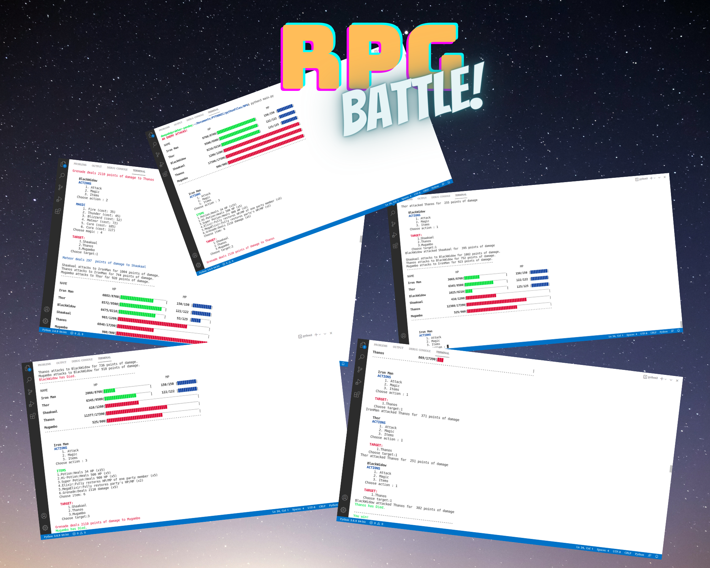

# RPG-Battle



A text-based role playing game developed in python3 which can be played on CLI.
The game includes different characters(Iron man, Thor and Black widow) and enemies(Thanos, Shaakaal and Mugambo) and different types of magic powers such as potions, elixirs, thunder, etc and weapon-items such as grenades make the players more powerful.

### Concepts used
Basic programming, functions, classes and objects(Object Oriented Programming) in Python


### Installation

Just download the zip file and extract it to some location/folder. Open command prompt/terminal and run the python file main.py

```
pyhton3 main.py
```


### Contributing
Pull requests are welcome. For major changes, please open an issue first to discuss what you would like to change.

Please make sure to update tests as appropriate.
